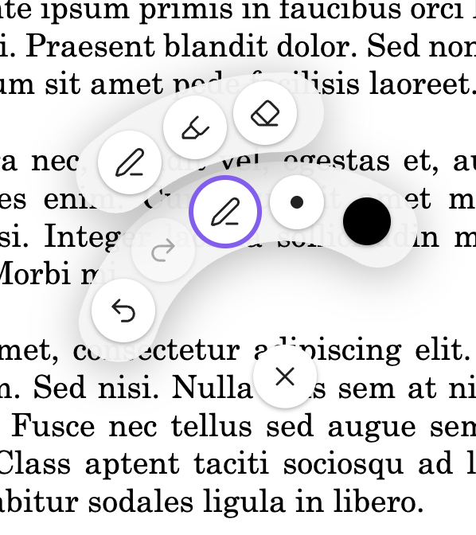
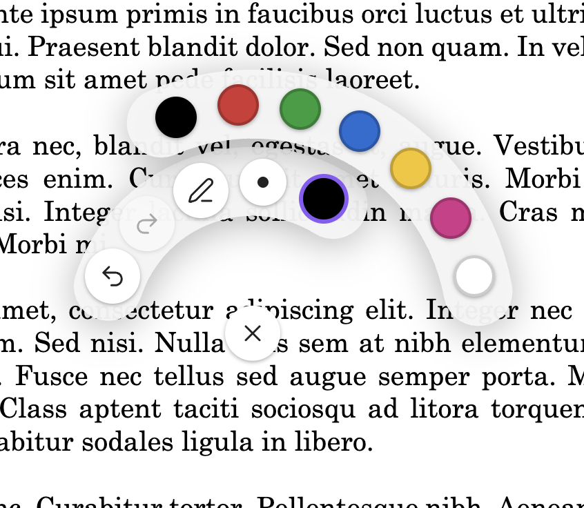
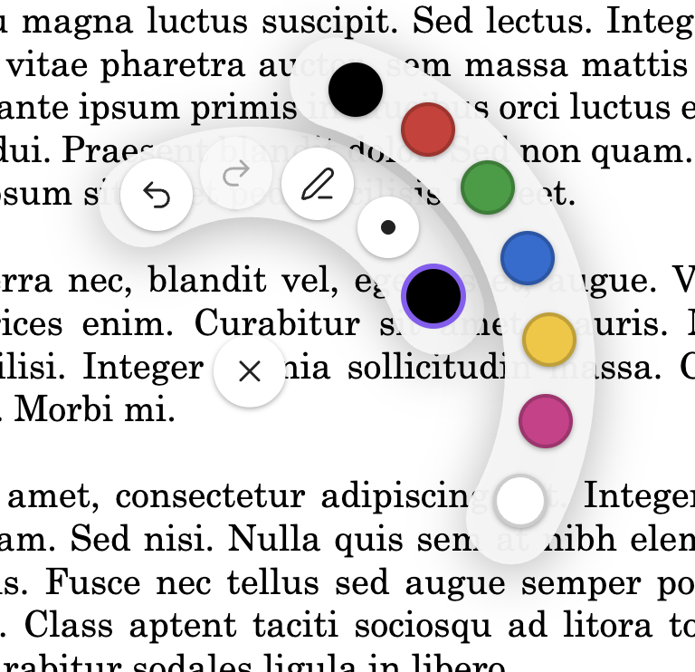

# Jot

Handwrite annotations on PDFs in Obsidian with your Apple Pencil. Strokes are stored in a tiny JSON sidecar (`<file>.jot.json`) next to the original file — the original PDF is never modified — so annotations sync via Git or iCloud alongside the rest of your vault.

I built this to annotate musical scores during rehearsal with our vocal band: things like breath marks, "watch out for thise note", etc. 

Status: **early, working**. PDFs only for now.



## Features

- Pressure-sensitive ink with Apple Pencil
- Pen, highlighter, and eraser; seven configurable colors; four widths
- Radial palette opens on long-press; remembers your last pen and highlighter settings
- Per-PDF undo/redo
- Merge annotations into a flattened PDF (overwrite or save a copy)
- Cross-device sync via the sidecar JSON — edit on iPad, see it on desktop




## Installing

Jot isn't in the community plugin store yet. For now, install via [BRAT](https://github.com/TfTHacker/obsidian42-brat):

1. Install **BRAT** from the community plugins browser.
2. Open BRAT's settings → *Add Beta plugin* → paste `https://github.com/bverbeken/jot`.
3. BRAT will fetch the latest release and enable Jot.

Community-store submission is planned once a few rough edges are polished.

## Using it

1. Open a PDF in Obsidian.
2. Long-press anywhere on the page with the Apple Pencil to open the radial palette. Pick a tool, color, or width.
3. Draw with the Apple Pencil. Rest your palm freely — touch input is ignored once a pen stroke starts.
4. Two-finger hold dismisses the palette. The palette also auto-dismisses after a brief confirmation animation when you pick a color.
5. Run the **Merge notes into PDF** command to bake annotations into a flattened PDF. Run **Clear annotations on this PDF** to wipe all strokes (undoable).

Set your handedness and customize the seven palette colors under *Settings → Jot*.

## Development

```bash
npm install
npm run dev     # watch build into dev-vault/.obsidian/plugins/jot/
npm run build   # production build at the repo root (for release uploads)
npm test        # vitest
```

Open `dev-vault/` as a vault in Obsidian to test. The dev vault is gitignored and is not your real notes vault.

### Testing on iPad

_1. Cut a GitHub release (`npm version patch` then `git push origin <tag>` — the release workflow uploads `main.js`, `manifest.json`, `styles.css`).
2. On the iPad, install **BRAT** into a *separate dev vault* — never your real one.
3. In BRAT, add this repo as a beta plugin. BRAT pulls the release and installs it._
